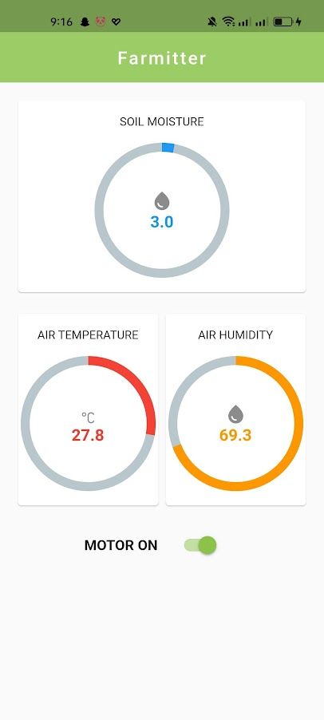

# SmartFarm

SmartFarm is an IoT based smart agriculture monitoring and automatic irrigation system developed using ESP8266 NodeMCU and Firebase Realtime Database. Features include monitoring soil moisture, air temperature and relative humidity of air, and remotely controlling irrigation. 
 
## Application Features

- Real-time monitoring of:
  - Soil moisture
  - Air temperature
  - Humidity 
- Visual display of circular indicators
- Automatic updates through Firebase listeners
- Remote control of water pump
- Pop-up notifications for pump state

## Tech Stack

- User interface: Flutter
- Firebase Realtime Database (IoT data sync)

## Preview

## Development

The project was developed by me and Rabbani2019331039 for our PROJECT 250 course during our undergrad 2nd year.

